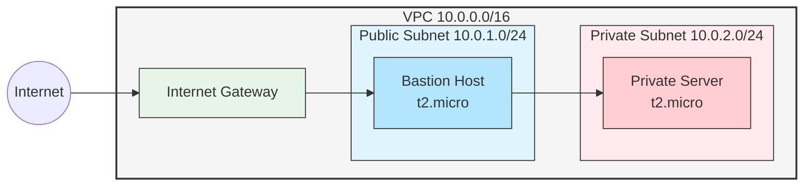

# Bastion Host Implementation Project

Project URL: [roadmap.sh/projects/bastion-host](https://roadmap.sh/projects/bastion-host)

## Project Overview
This project implements a secure bastion host architecture in AWS, providing a secure way to access private infrastructure. The implementation includes VPC setup, security configurations, and SSH hardening measures.

## Architecture



### Components Created
1. **VPC (10.0.0.0/16)**
   - Public Subnet: 10.0.1.0/24
   - Private Subnet: 10.0.2.0/24
   - Internet Gateway
   - Route Tables for public and private subnets

2. **EC2 Instances**
   - Bastion Host (Public)
     - Instance Type: t2.micro
     - AMI: Amazon Linux 2
   - Private Server
     - Instance Type: t2.micro
     - AMI: Amazon Linux 2

3. **Security Groups**
   ```json
   Bastion Security Group:
   - Inbound: SSH (22) from 0.0.0.0/0
   - Outbound: All traffic

   Private Server Security Group:
   - Inbound: SSH (22) from Bastion SG
   - Outbound: All traffic
   ```

## Implementation Steps

### 1. VPC Setup
```bash
# Create VPC
aws ec2 create-vpc --cidr-block 10.0.0.0/16

# Create Subnets
aws ec2 create-subnet --vpc-id $VPC_ID --cidr-block 10.0.1.0/24
aws ec2 create-subnet --vpc-id $VPC_ID --cidr-block 10.0.2.0/24

# Create and Attach Internet Gateway
aws ec2 create-internet-gateway
aws ec2 attach-internet-gateway --vpc-id $VPC_ID --internet-gateway-id $IGW_ID
```

### 2. Security Group Configuration
```bash
# Bastion Security Group
aws ec2 create-security-group --group-name bastion-sg \
  --description "Security group for bastion host" --vpc-id $VPC_ID

# Private Server Security Group
aws ec2 create-security-group --group-name private-sg \
  --description "Security group for private instance" --vpc-id $VPC_ID
```

### 3. Instance Launch
```bash
# Launch Bastion Host
aws ec2 run-instances --image-id $AMI_ID --instance-type t2.micro \
  --key-name your-key-name --security-group-ids $BASTION_SG_ID \
  --subnet-id $PUBLIC_SUBNET_ID

# Launch Private Server
aws ec2 run-instances --image-id $AMI_ID --instance-type t2.micro \
  --key-name your-key-name --security-group-ids $PRIVATE_SG_ID \
  --subnet-id $PRIVATE_SUBNET_ID
```

### 4. SSH Configuration
Example SSH config:
```
Host bastion
    HostName <bastion-public-ip>
    User ec2-user
    IdentityFile ~/.ssh/your-key.pem

Host private-server
    HostName <private-server-private-ip>
    User ec2-user
    ProxyJump bastion
    IdentityFile ~/.ssh/your-key.pem
```

## Infrastructure Automation with Terraform

### Directory Structure
```
terraform/
├── main.tf              # Main Terraform configuration
├── variables.tf         # Variable definitions
├── outputs.tf          # Output definitions
├── terraform.tfvars.example  # Example variables file
└── scripts/
    └── bastion_setup.sh     # Bastion host setup script
```

### Prerequisites
1. [Terraform](https://www.terraform.io/downloads.html) installed (v1.0.0 or newer)
2. AWS credentials configured
3. SSH key pair created in AWS

### Quick Start
1. Clone this repository
2. Navigate to the terraform directory:
   ```bash
   cd terraform
   ```

3. Copy and configure variables:
   ```bash
   cp terraform.tfvars.example terraform.tfvars
   # Edit terraform.tfvars with your values
   ```

4. Initialize Terraform:
   ```bash
   terraform init
   ```

5. Review the execution plan:
   ```bash
   terraform plan
   ```

6. Apply the configuration:
   ```bash
   terraform apply
   ```

### What Gets Created
- VPC with public and private subnets
- Internet Gateway
- Route tables
- Security groups for bastion and private instances
- EC2 instances (bastion host and private server)
- Automatic security configurations:
  - fail2ban installation and configuration
  - SSH hardening
  - Security group rules

### Customization
You can customize the deployment by modifying:
- `terraform.tfvars`: Change region, CIDR blocks, instance types
- `scripts/bastion_setup.sh`: Modify security configurations
- `main.tf`: Adjust resource configurations

### Cleanup
To destroy all created resources:
```bash
terraform destroy
```

## Cleanup Process
When you're done with the bastion host setup, follow these steps to clean up all AWS resources in the correct order to avoid dependency conflicts:

### 1. Terminate EC2 Instances
```bash
# Terminate the bastion host
aws ec2 terminate-instances --instance-ids <bastion-instance-id>

# Wait for instance to fully terminate
aws ec2 describe-instances --instance-ids <bastion-instance-id>
# Check that state is "terminated"
```

### 2. Delete Network Components
Delete components in this specific order to handle dependencies:

1. Detach and Delete Internet Gateway:
```bash
# Detach from VPC
aws ec2 detach-internet-gateway \
    --internet-gateway-id <igw-id> \
    --vpc-id <vpc-id>

# Delete the internet gateway
aws ec2 delete-internet-gateway --internet-gateway-id <igw-id>
```

2. Delete Security Groups:
```bash
# Delete private server security group
aws ec2 delete-security-group --group-id <private-sg-id>

# Delete bastion host security group
aws ec2 delete-security-group --group-id <bastion-sg-id>
```

3. Delete Subnets:
```bash
# Delete public subnet
aws ec2 delete-subnet --subnet-id <public-subnet-id>

# Delete private subnet
aws ec2 delete-subnet --subnet-id <private-subnet-id>
```

4. Delete Route Tables:
```bash
# Delete custom route tables
aws ec2 delete-route-table --route-table-id <route-table-id>
```

5. Delete VPC:
```bash
# Finally, delete the VPC
aws ec2 delete-vpc --vpc-id <vpc-id>
```

### Verification Steps
After deletion, verify that all resources are removed:

```bash
# Check VPC
aws ec2 describe-vpcs --vpc-id <vpc-id>
# Should return: InvalidVpcID.NotFound

# Check Security Groups
aws ec2 describe-security-groups --group-ids <sg-id>
# Should return: InvalidGroup.NotFound

# Check Subnets
aws ec2 describe-subnets --subnet-ids <subnet-id>
# Should return: InvalidSubnetID.NotFound

# Check Internet Gateway
aws ec2 describe-internet-gateways --internet-gateway-ids <igw-id>
# Should return: InvalidInternetGatewayID.NotFound
```

### Common Issues During Cleanup
1. **Dependency Violations**: If you receive a dependency violation error, it means you're trying to delete a resource that other resources still depend on. Follow the order specified above.

2. **Resource Still in Use**: Sometimes AWS needs a few minutes to fully process the termination of resources. Wait a few minutes and try again.

3. **Main Route Table**: The main route table associated with the VPC will be automatically deleted when the VPC is deleted.

### Cost Implications
- Terminating resources stops any ongoing charges
- Check your AWS billing dashboard to confirm no unexpected charges
- Some resources like EBS volumes might need separate deletion if not set to auto-delete

## Proof of Implementation

### 1. VPC and Subnet Creation
```bash
$ aws ec2 describe-vpcs
{
    "Vpcs": [
        {
            "CidrBlock": "10.0.0.0/16",
            "State": "available",
            "VpcId": "vpc-xxxxx",
            "InstanceTenancy": "default",
            "CidrBlockAssociationSet": [
                {
                    "CidrBlock": "10.0.0.0/16",
                    "CidrBlockState": {
                        "State": "associated"
                    }
                }
            ],
            "Tags": [
                {
                    "Key": "Name",
                    "Value": "bastion-vpc"
                }
            ]
        }
    ]
}
```

### 2. Security Groups Configuration
```bash
$ aws ec2 describe-security-groups
{
    "SecurityGroups": [
        {
            "GroupName": "bastion-sg",
            "Description": "Security group for bastion host",
            "IpPermissions": [
                {
                    "FromPort": 22,
                    "IpProtocol": "tcp",
                    "IpRanges": [
                        {
                            "CidrIp": "0.0.0.0/0"
                        }
                    ],
                    "ToPort": 22
                }
            ]
        },
        {
            "GroupName": "private-sg",
            "Description": "Security group for private instance",
            "IpPermissions": [
                {
                    "FromPort": 22,
                    "IpProtocol": "tcp",
                    "UserIdGroupPairs": [
                        {
                            "GroupId": "<bastion-sg-id>"
                        }
                    ],
                    "ToPort": 22
                }
            ]
        }
    ]
}
```

### 3. EC2 Instances
```bash
$ aws ec2 describe-instances --query "Reservations[*].Instances[*].[Tags[?Key=='Name'].Value|[0],State.Name]" --output table
---------------------------------
|       DescribeInstances        |
+---------------+---------------+
|  bastion-host |  running     |
|  private-server|  running     |
+---------------+---------------+
```

### 4. SSH Configuration File
```bash
$ cat ~/.ssh/config
Host bastion
    HostName <bastion-public-ip>
    User ec2-user
    IdentityFile ~/.ssh/your-key.pem

Host private-server
    HostName <private-ip>
    User ec2-user
    ProxyJump bastion
    IdentityFile ~/.ssh/your-key.pem
```

### 5. fail2ban Installation and Configuration
```bash
$ ssh bastion "systemctl status fail2ban"
● fail2ban.service - Fail2Ban Service
   Loaded: loaded
   Active: active (running)
```

### 6. SSH Hardening Verification
```bash
$ ssh bastion "sudo sshd -T | grep -E 'permitrootlogin|passwordauthentication|x11forwarding'"
permitrootlogin no
passwordauthentication no
x11forwarding no
```

### 7. Connection Tests
```bash
$ ssh bastion "echo 'Connection to bastion host successful!'"
Connection to bastion host successful!

$ ssh private-server "echo 'Connection to private server successful!'"
Connection to private server successful!
```

## Security Features
1. **Network Security**
   - Private server accessible only through bastion host
   - Public subnet with Internet Gateway for bastion
   - Private subnet for secure server

2. **Access Control**
   - Key-based authentication only
   - fail2ban for brute force protection
   - No root login allowed
   - SSH hardening configurations

3. **Monitoring**
   - SSH session logging
   - fail2ban logs for access attempts

## Challenges Faced
1. **SSH Access Issues**
   - Problem: Lost SSH access after implementing strict security measures
   - Solution Attempted: Created temporary security group for recovery
   - Status: Access recovery in progress

2. **Security Implementation**
   - MFA implementation pending
   - iptables configuration pending

## Future Improvements
1. Implement Multi-Factor Authentication (MFA)
2. Configure iptables for granular traffic filtering
3. Set up CloudWatch monitoring
4. Implement automatic security patches
5. Add backup and disaster recovery procedures

## Resources Used
1. [AWS VPC Documentation](https://docs.aws.amazon.com/vpc/)
2. [AWS EC2 Documentation](https://docs.aws.amazon.com/ec2/)
3. [OpenSSH Documentation](https://www.openssh.com/manual.html)
4. [fail2ban Documentation](https://www.fail2ban.org/wiki/index.php/Main_Page)

## Project Status
- Core infrastructure: Complete
- Basic security measures: Complete
- Advanced security (MFA, iptables): Pending
- Documentation: Complete